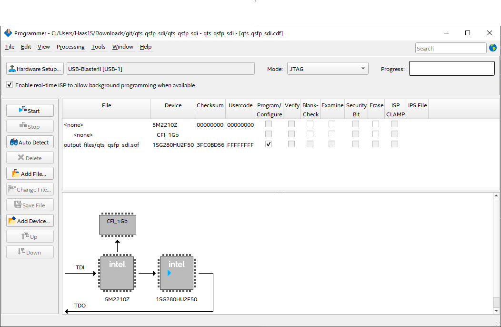
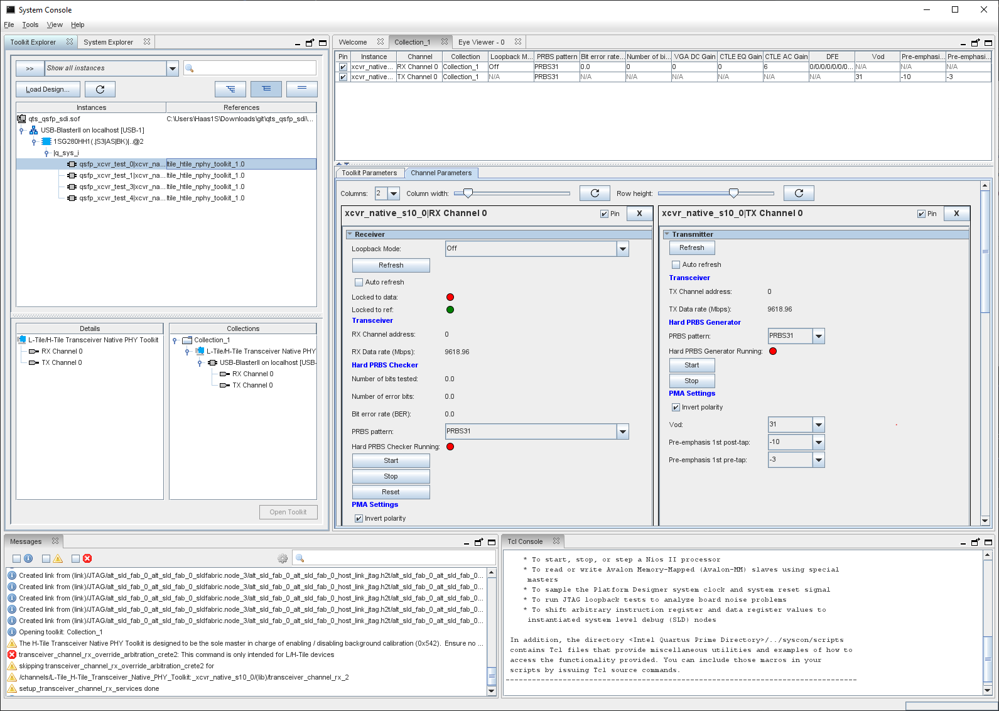
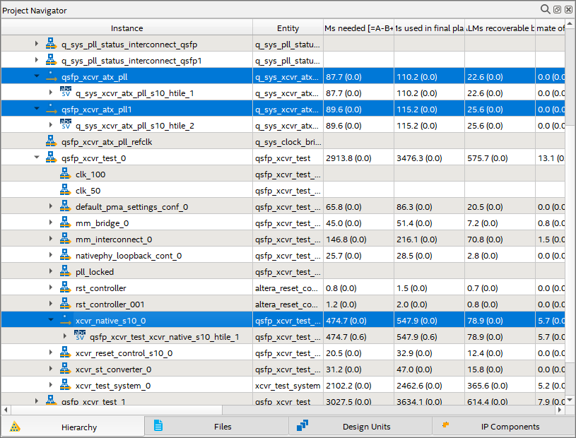
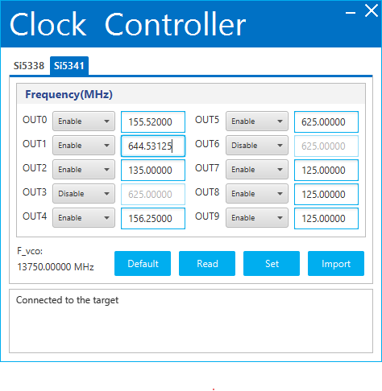

# qts_qsfp_sdi

PRBS tester for Stratix 10 GX dev board QSFP port

Start Quartus Prime Pro 23.3.0

Open project file: qts_qsfp_sdi.qpf
(Compile if needed)

Turn on dev board and sRTM power:
(and extra fan blowing on QSFP port)
<pre>
import serial
s=serial.Serial("COM3")
s.write(b"haasoscope on") # for Stratix dev kit power
s.write(b"haasoscope off")
s.write(b"arduino_12 on") # for 2-slot ATCA crate power
s.write(b"arduino_12 off")
</pre>

Program the dev board: open output_files/qts_qsfp_sdi.cdf

Run System Debugging Toolkits from Quartus Tools / System Debugging Tools menu

(see the Readme.txt file in the quartus subdirectory in this git repo for preventing the dreaded transceiver_channel_rx_override_arbitration_crete2 error)

Double-click channels in the left bar to open them, then click pin for each on the right

Start and stop PRBS tests and adjust parameters as needed

Can do eye diagram test via Tools / Eye Viewer in System Debugging Toolkits menu

These are the IP to open to adjust QSFP settings:

There are 3 profiles which can be changed in the IP (must change all 3 to the same profile!):
 - reconfiguration profile 0: 10.3125 Gbps (set pll at 644.53125 MHz, default)
 - reconfiguration profile 1: 25.6506 (was 25781.25) Gbps (set pll at 641.265 MHz)
 - reconfiguration profile 2: 9.61896 Gbps (set pll at 601.185 MHz)

At the moment you must recompile the project (and reprogram the board) to switch profiles
(but there are also binaries saved for 9,10,25 Gbps that can simply be used)

Note that the clock PLL must be changed for profiles 1 or 2 (after the board is turned on):
open ..\stratix10GX_1sg280uf50_fpga_revd_htile_v18.1b222_v1.0\examples\board_test_system\ClockController.exe
and adjust OUT1 on the Si5341 to the proper pll freq mentioned above for the given profile:

